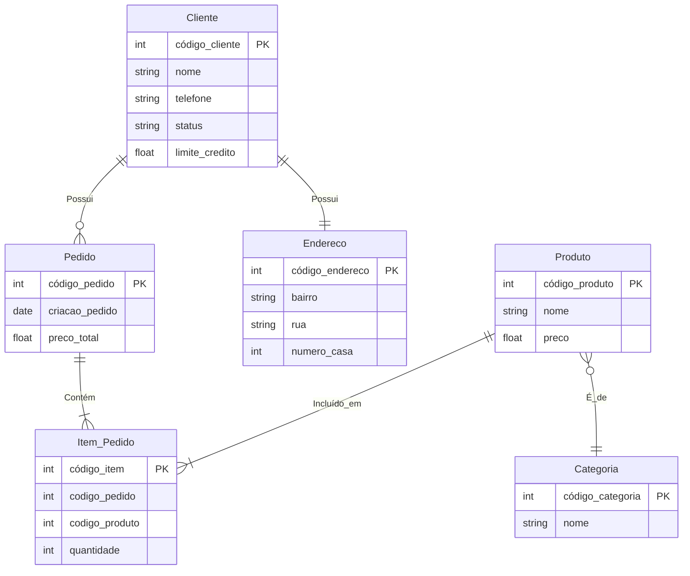

```mermaid

erDiagram
  Produto }o -- || Categoria: É_de
  Cliente || -- || Endereco: Possui
  Cliente || -- }o Pedido: Possui
  Pedido || -- |{ Item_Pedido: Contém
  Produto || -- |{ Item_Pedido: Incluído_em

Produto {
  int código_produto PK
  string nome
  float preco
}

Categoria {
  int código_categoria PK
  string nome
}

Cliente {
  int código_cliente PK
  string nome
  string telefone
  string status
  float limite_credito
}

Endereco {
  int código_endereco PK
  string bairro
  string rua
  int numero_casa
}

Pedido {
  int código_pedido PK
  date criacao_pedido
  float preco_total
}

Item_Pedido {
  int código_item PK
  int codigo_pedido
  int codigo_produto
  int quantidade
}

```
